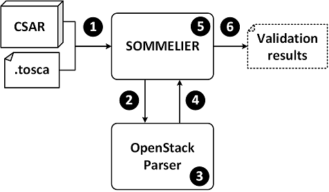

# Sommelier

Sommelier is a prototype, command-line tool for **validating TOSCA application topologies**.

## About 

### Validation constraints
All the validation constraints that are checked by Sommelier have been defined in the research paper:
 > _A. Brogi, A. Di Tommaso, J. Soldani. <br>
 > **Validating TOSCA application topologies.** <br>
 > Submitted for publication_

If you wish to exploit Sommelier to carry out research activities, or if you wish to reuse its sources, please properly cite the above mentioned paper. Below you can find the BibTex reference:
```
@article{Sommelier,
 author = {Brogi, Antonio and Di~Tommaso, Antonio and Soldani, Jacopo},
 title = {Validating TOSCA application topologies},
 note = {\em [Submitted for publication]}
} 
```

### How Sommelier works



 1.  Sommelier takes as input either a [YAML](http://yaml.org/spec/) file or a [CSAR](http://docs.oasis-open.org/tosca/TOSCA-Simple-Profile-YAML/v1.0/cos01/TOSCA-Simple-Profile-YAML-v1.0-cos01.html#_Toc461787381) archive containing the TOSCA application topology to be validated.
 
 2. The input is forwarded by Sommelier to the [OpenStack TOSCA parser](https://github.com/openstack/tosca-parser).
 
 3. The TOSCA parser checks whether the TOSCA application is syntactically correct. If so, the parser generates a set of Python objects representing the TOSCA application.

 4. The Python objects representing the TOSCA application are returned to Sommelier.
 
 5. Sommelier validates the topology of the TOSCA application by checking whether the Python objects representing such application satisfy all the validation conditions listed in the aforementioned paper.
 
 6. The results of the validation are displayed by Sommelier.
 
## Using Sommelier
Sommelier is designed to run on `bash` shells.

### Prerequisites
To effectively be executed on a `bash` shell, Sommelier requires such shell to support the following commands:
 * `python`,
 * `pip`, and
 * `tosca-parser` (which can be installed by typing `sudo pip install 'tosca-parser'`).

### Running Sommelier
To run Sommelier, just type `python sommelier.py --template-file=[topology-template-file-name]`


